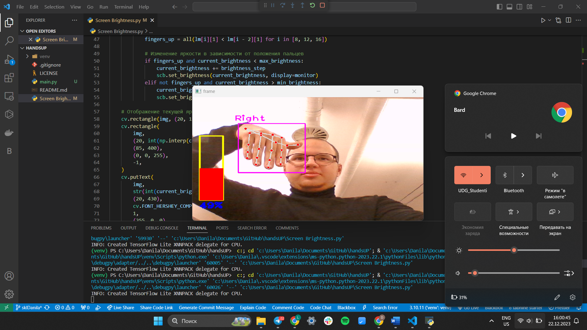
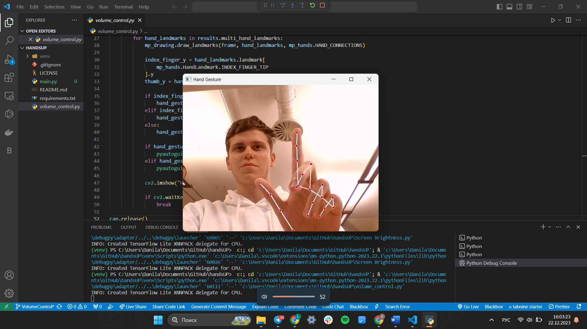

# HANDSUP AI


Detecting hand parts, controlling windows media controllers using gestures, and identifying road lanes using computer vision.

[](https://github.com/monxchrome/handsUP)
[](https://pypi.org/project/pypi-latest/)
[](https://pypi.python.org/pypi/readmeai/)


---

## 🔗 Quick Links
* [Overview](#-overview)
* [Features](#-features)
* [Getting Started](#-getting-started)
* [Project Roadmap](#-project-roadmap)
* [License](#-license)

---

## 🔭 Overview

***Objective***

<em>HANDSUP-AI</em> Our unique and innovative AI technologies can be trusted when it comes to interacting with your computer and the road environment. Our AI has a unique set of features that includes hand detection and gesture recognition to control Windows Media Player, as well as detecting road lines to intelligently change lanes.<br>

## 🤖 Features

<br>
<div>
<details>
    <summary style="display: flex; align-items: center;">
        <span style="font-size: 2.0em;"> ❶ Hand and gesture detection</span>
    </summary>
    <table>
        <tr>
            <td>
                <h4><i>Project Hand and gesture detection</i></h4>
                <p>
                    ‣ Our AI exhibits high precision in recognizing user hands and dynamic gestures, making Windows Media Player control more intuitive and convenient. Easily adjust volume, switch tracks, and manage multimedia functions with natural hand movements.
                </p>
            </td>
        </tr>
        <tr>
            <td>
                
            </td>
        </tr>
    </table>
</details>
</div>
<br>
<div>
    <details>
        <summary style="display: flex; align-items: center;">
            <span style="font-size: 2.0em;"> ❷ Virtual Mouse Functionality</span>
        </summary>
        <table>
            <tr>
                <td colspan="2">
                    <h4><i>Virtual Mouse Functionality</i></h4>
                </td>
            </tr>
            <tr>
                <td colspan="2">
                    <p>‣ Our AI is equipped with advanced virtual mouse capabilities, allowing users to interact with their computer screens using hand gestures. Navigate through applications, click, and scroll effortlessly in a virtual environment, providing a hands-free and intuitive computing experience.</p>
                </td>
            </tr>
            <tr>
                <td align="center">
                    
                </td>
            </tr>
        </table>
    </details>
</div>
<br>
<div>
    <details>
        <summary style="display: flex; align-items: center;">
            <span style="font-size: 2.0em;"> ❸ Integration with Windows Media</span>
        </summary>
        <table>
            <tr>
                <td>
                    <h4><i>Integration with Windows Media</i></h4>
                    <p>
                        ‣ Our AI seamlessly integrates with Windows Media Player, ensuring smooth and efficient control of multimedia files. Simple gestures allow you to enjoy your music and videos effortlessly, making the control process more natural.
                    </p>
                </td>
            </tr>
            <tr>
                <td>
                    
                </td>
                <td>
                    
                </td>
            </tr>
        </table>
    </details>
</div>
<br>
<div>
    <details>
        <summary style="display: flex; align-items: center;">
            <span style="font-size: 2.0em;"> ❸ Intelligent Interaction</span>
        </summary>
        <table>
            <tr>
                <td colspan="2">
                    <h4><i>Intelligent Interaction</i></h4>
                </td>
            </tr>
            <tr>
                <td colspan="2">
                    <p>‣ Our AI is designed to understand and respond to your natural movements, creating a more intuitive and personalized user experience. It adapts to your gestures, providing a dynamic and responsive interaction that feels like second nature.</p>
                </td>
            </tr>
        </table>
    </details>
</div>
<br>
<div>
    <details>
        <summary style="display: flex; align-items: center;">
            <span style="font-size: 2.0em;"> ❹ Autonomous Interaction:</span>
        </summary>
        <table>
            <tr>
                <td colspan="2">
                    <h4><i>Autonomous Interaction:</i></h4>
                </td>
            </tr>
            <tr>
                <td colspan="2">
                    <p>‣ Experience a new level of automation as our AI learns from your behaviors, adapting and anticipating your preferences. This autonomous capability ensures a more personalized and efficient user experience over time.</p>
                    <p>‣ Our AI isn't just a technological advancement; it's a revolutionary companion that seamlessly integrates into your digital world, providing an unparalleled level of convenience, adaptability, and interaction. Embrace the future with our intelligent AI system — your gateway to a more connected and intuitive experience.</p>
                </td>
            </tr>
        </table>
    </details>
</div>
<br>
<br>

<p align="right">
  <a href="#top"><b>Return </b></a>
</p>

---

## 👩‍💻 Getting Started

***Dependencies***

Please ensure you have the following dependencies installed on your system:

- *Python 3.9+*
- *Pip, Pipenv, or Conda*

<br>

***Repository***

A remote repository URL or local directory path to your project is needed to use *handsup-ai*. The following platforms are currently supported:
- *GitHub*
- *GitLab*
- *Bitbucket*
- *File System*

<br>

---

### 📦 Installation

Using `pip`
```bash
pip install opencv-python, PyAutoGUI, mediapipe
```

Using `conda`
```bash
conda install -c conda-forge opencv-python, PyAutoGUI, mediapipe
```

<br>

Alternatively, clone the readme-ai repository and build from source.

```bash
git clone https://github.com/monxchrome/handsUP && \
cd handsUP
```

Using `pipenv`
```bash
pipenv install && \
pipenv shell
```

<br>

---

### 🚀 Running *HANDSUP-AI*

Create environment.

On `Linux/MacOS`
```bash
python -m venv venv
source venv/bin/activate
```

On `Windows`
```bash
python -m venv venv
source venv/scripts/activate
```

Next, run app.

Using `python3`
```bash
python3 HandTracking.py
```

or

Using `python3`
```bash
python3 volume_control.py
```

or

Using `python3`
```bash
python3 Screen Brightness.py
```

<br>

Using `conda`
```bash
python HandTracking.py
```

or

Using `conda`
```bash
python volume_control.py
```

or

Using `conda`
```bash
python Screen Brightness.py
```

---

## 🛠 Project Roadmap

- [X] Publish project as a Python library via PyPI for easy installation.
  - [*PyPI - handsUP*]
- [X] Refactor our handsUP code.
- [ ] Building template system to create HANDSUP files for specific use-cases (data, mobile, web, etc.)
- [ ] Add support for generating HANDSUP files in any language (i.e. CN, ES, FR, JA, KO, RU).
- [ ] Develop GitHub Actions script to automatically update the HANDSUP file when new code is pushed.

---

---

## 🛠 Literature

- [OpenCV](https://docs.opencv.org/4.x/d6/d00/tutorial_py_root.html)
- [MediaPipe](https://developers.google.com/mediapipe/framework/getting_started/python_framework)

---

## 📄 License

[Apache](https://github.com/monxchrome/handsUP/blob/main/LICENSE)

---

<p align="right">
  <a href="#top"><b>Return</b></a>
</p>
